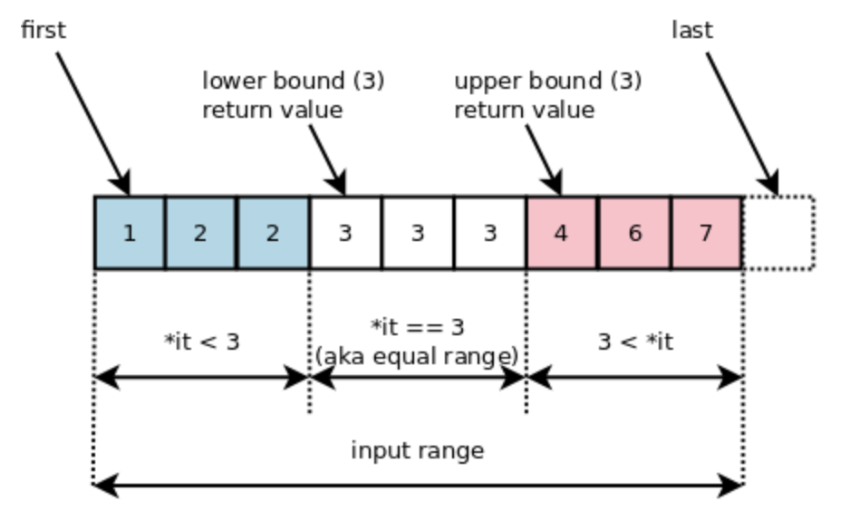

# Binary Search

## 🍎 정의
- 이분 탐색이란 두개의 인덱스의 위치를 바꿔가며 타겟 값이 나올 수 있는 범위를 줄여가며 탐색하는 방법.

## 🍎 기본 이분 탐색 코드
- 이분 탐색으로 타겟을 찾으려고 하는 배열은 오름차순 정렬이 보장 되어 있어야 한다.
- 타겟이 있을 수 있는 범위가 계속 반으로 줄어들기 때문에 시간복잡도는 O(logN)
```swift
func binarySearch(_ array: [Int], target: Int) -> Bool {
    var start = 0
    var end = array.count - 1
    
    while start <= end {
        let mid = (start + end) / 2
        
        if array[mid] == target { return true }
        if array[mid] > target {
            end = mid - 1
        } else {
            start = mid + 1
        }
    }
    return false
}
```
### 📖 start < end와 start <= end 중 무엇을 써야할까?
- **특정한 수가 배열에 있는지 이분 탐색으로 확인할 때는 while 조건문에 start <= end를 써야한다!**
- 아래 두개의 테스트를 통해 start < end의 허점을 알아보자!

#### 🔥 while의 조건문이 start < end 일때, 가장 왼쪽(가장 작은)의 수를 찾아보자!
- [2,4,6,8,10,12,14,16,18,20] 이라는 배열에 2이라는 숫자가 있는지 확인하고 싶다!
```swift
print(binarySearch([2,4,6,8,10,12,14,16,18,20], target: 2))
```
- while 조건문을 start < end로 두었을때 target을 찾아가는 과정을 start와 end의 관점으로 트랙킹 해보자.
```bash
0 9
0 3
false
```
- 2라는 숫자는 배열에 있는데 왜 없다고 false가 나올까?
- 마지막 s와 e를 통해 반복문이 종료되기 직전의 s, e, mid 를 구해보자.
- s(0) + e(3)은 3이고 mid는 (3/2)인 1이된다.
- 4는 2보다 크기 때문에 end는 (mid - 1) = (1 - 1)인 0이된다.
- 현재 조건이 start < end 이기 때문에 더 이상 반복문이 실행되지 않고 false를 리턴한 채 종료된다.

#### 🔥 while의 조건문이 start < end 일때, 가장 오른쪽(가장 큰)의 수를 찾아보자!
- 동일하게 위와 같이 [2,4,6,8,10,12,14,16,18,20]이라는 배열에서 이번엔 20이라는 숫자가 있는지 확인하고 싶다!
```swift
print(binarySearch([2,4,6,8,10,12,14,16,18,20], target: 20))
```
- while 조건문을 start < end로 두었을때 target을 찾아가는 과정을 start와 end의 관점으로 트랙킹 해보자.
```bash
0 9
5 9
8 9 
false
```
- 20이라는 숫자는 배열에 있는데 왜 없다고 false가 나올까?
- 마지막 s와 e를 통해 반복문이 종료되기 직전의 s, e, mid 를 구해보자.
- s(8) + e(9)는 17이고 mid(17/2)는 8이된다.
- 18은 20보다 작기 때문에 start는 (mid + 1) = (8 + 1)인 9가 된다.
- 현재 조건이 start < end 이기 때문에 더 이상 반복문이 실행되지 않고 false를 리턴한 채 종료된다.

### 📖 위의 두 테스트 정리
- 가장 작은 값(가장 좌측)을 찾으려고 할때는 end가 start와 같은 인덱스가 되어서 반복문을 빠져나오고, false를 반환.
- 가장 큰 값(가장 우측)을 찾으려고 할떄는 start가 end와 같은 인덱스가 되어서 반복문을 빠져나오고, false를 반환한다.
- 그럼 가장 작은 값과 가장 큰 값을 제외한 사이의 값들을 잘 찾을 수 있을까? -> 잘 찾을 수 있다!
- **하지만, 가장 자리에 우리가 찾으려는 값이 있을 수도 있으므로 이분 탐색에서 특정한 수를 찾을때는, 가장 왼쪽, 가장 오른쪽까지의 탐색을 위해 start < end 조건 대신 start <= end라는 조건을 사용해서 s 또는 e가 가장자리 까지 갈 수 있도록 해주면 된다.**


## 🍎 lower bound, upper bound 정리
- lower bound -> 데이터 내에서 특정 값보다 같거나 큰 값이 처음 나오는 위치
- upper bound -> 특정 값보다 처음으로 큰 값이 나오는 위치


### 📖 먼저 lower bound를 코드를 통해 조금 더 자세히 알아보자!
```swift
var arr = [1,1,1,2,2,3,3,3,4,4,5,5]
var low = 0
var high = arr.count
var mid = 0

// lower bound 구하는 코드
while low < high {
    mid = (low + high) / 2
    if target <= arr[mid] {      // 찾으려는 숫자(target)이 arr[mid]보다 작거나 같다면,
        high = mid               // high를 mid로, 점점 왼쪽으로 가려고 한다.
    } else {                     // 찾으려는 숫자가 arr[mid]보다 크다면
        low = mid + 1            // low를 현재 mid의 오른쪽에 둔다.
    }
}
```
### 📖 알아두기!
- high를 arr.count로 초기화한다
    - 위의 배열에서 100을 찾는다고 가정하고, 만약 high를 arr.count - 1로 놓는다면 실제로는 100이 없음에도 불구하고 11을 반환한다.
    - 이러한 불상사를 막기 위해서 high를 arr.count로 초기화 한다.
- **lower bound에서 찾으려는 값이 arr[0]보다 작아서 없을때, 0이 나온다.**
- **lower bound에서 찾으려는 값이 arr[arr.count - 1] 보다 커서 없을때, arr.count가 나온다.**

### 📖 lower bound내 while의 조건문에서 "<=" 이 안되는 이유, "<"만 가능한 이유
- 만약 찾으려는 수(target num)가 arr[arr.count-1]보다 커서 배열에 없는 경우에는 low가 계속 올라가 high와 같아지는데,
- 이때 high를 살펴보면 arr.count로 값이 설정 되어있다. 위의 arr 배열을 예시로 보면 low는 0부터 7, 10, 12가 된다. 이때 mid를 구하면 (12 + 12) / 2 = 12가 되고, arr[12]은 배열의 범위를 벗어나 접근할 수 없기 때문에 런타임 에러를 발생시킨다.

### 📖 이제 upper bound를 코드를 통해 자세히 살펴보자!
```swift
var arr = [1,1,1,2,2,3,3,3,4,4,5,5]
var low = 0
var high = arr.count
var mid = 0

// upper bound 구하는 코드
while low < high {
    mid = (low + high) / 2
    if target < arr[mid] {
        high = mid
    } else {
        low = mid + 1
    }
}
print(low)
```
- **lower bound 코드와 다른점은 if 조건문에서 lower bound의 <= 이 < 으로 변한것 뿐.**
- **마찬가지로 타겟 넘버가 arr[0]보다 작으면 0을 출력, 타겟 넘버가 arr[arr.count - 1]보다 큰 경우는, arr.count를 출력한다.**


## 🍎 참고 블로그
- [lower / upper bound](https://hee96-story.tistory.com/80)
